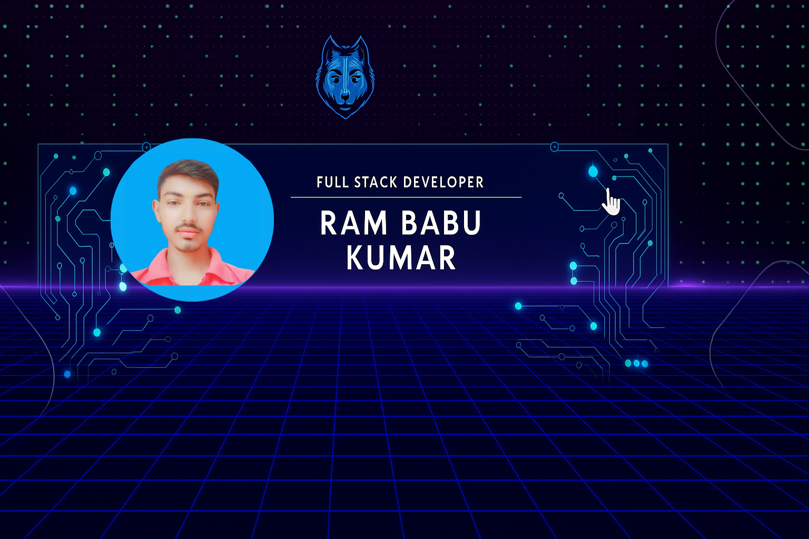

<h1 align="center">Hi 👋, I'm Ram Babu Kumar</h1>
<h3 align="center">A passionate Full Stack Developer from India</h3>

  

- 🌱 I’m currently learning **MERN Stack (MongoDB,Express,React,Node.js) Git & GitHub for version control**
- 👯 I’m looking to collaborate on **Open source web development projects**
- 🤝 I’m looking for help with **Bakend Development (Node.js, Express)**
- 💬 Ask me about **HTML,CSS,Javascript,React,GitHub**

- ⚡ Fun fact **I am Funny 😅**
- <h3 align="left">Connect with me:</h3>

<h3 align="left">Languages and Tools:</h3>
          

&nbsp;

